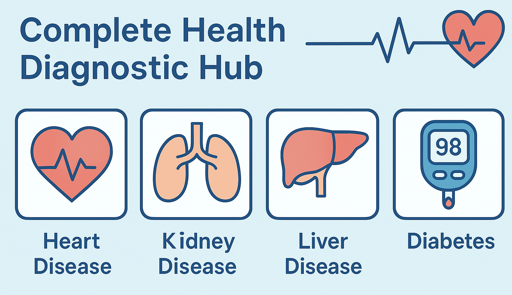

# Complete Health Diagnostic Hub 🏥💡



Welcome to the **Complete Health Diagnostic Hub** 🏥, a machine-learning-based system designed to predict the likelihood of heart disease, kidney disease, liver disease, and diabetes using advanced classification algorithms. 🚀

## 🌟 Features
- ✅ Predicts **Heart Disease**, **Kidney Disease**, **Liver Disease**, and **Diabetes**.
- 🤖 Utilizes **Logistic Regression, Decision Tree, KNN, Random Forest, and SVM** models.
- 🔬 Data sourced from **Kaggle** for robust training.
- 📊 Feature selection and preprocessing for optimal accuracy.
- 🌐 Flask-based web application for user-friendly predictions.

## 🏠 Technologies Used
- **Python 3.10** 🐍
- **Flask** 🌍 (For web deployment)
- **Pandas, NumPy** 📊 (Data Processing)
- **Matplotlib, Seaborn** 📈 (Data Visualization)
- **Scikit-learn** 🤖 (Machine Learning)
- **Joblib, Pickle** 🔄 (Model Serialization)

## 🛠️ Setup & Installation

```bash
# Clone the repository
git clone https://github.com/JiteshShelke/Complete-Health-Diagnostic-Hub.git
cd Complete-Health-Diagnostic-Hub

# Create a virtual environment
python -m venv env
source env/bin/activate  # On Windows: env\Scripts\activate

# Install dependencies
pip install -r requirements.txt
```

## 🚀 How to Run

```bash
# Run the Flask app
python app.py

# Open in your browser
http://127.0.0.1:5000/
```

## 📂 Dataset Information
The project utilizes four medical datasets from **Kaggle**:
1. **Heart Disease Dataset** ❤️ - [Download Here](https://www.kaggle.com/datasets/your-heart-disease-dataset)
2. **Kidney Disease Dataset** 🩸 - [Download Here](https://www.kaggle.com/datasets/your-kidney-disease-dataset)
3. **Liver Disease Dataset** 🏥 - [Download Here](https://www.kaggle.com/datasets/your-liver-disease-dataset)
4. **Diabetes Dataset** 🧑‍⚕️ - [Download Here](https://www.kaggle.com/datasets/your-diabetes-dataset)

## 🎯 Methodology

1. **Data Collection** 💞 - Datasets sourced from Kaggle.
2. **Data Preprocessing** 🛠️ - Handling missing values, encoding, and scaling.
3. **Feature Selection** 🔍 - Key attributes selected based on medical relevance.
4. **Model Training** 🤖 - Various ML models trained and evaluated.
5. **Evaluation Metrics** 📊 - Accuracy, Precision, Recall, and F1-score.
6. **Deployment** 🌐 - Model integrated into a Flask web app.

## 🌍 API Endpoints

| Method | Endpoint | Description |
|--------|---------|-------------|
| `POST` | `/predict/heart` | Predicts Heart Disease |
| `POST` | `/predict/kidney` | Predicts Kidney Disease |
| `POST` | `/predict/liver` | Predicts Liver Disease |
| `POST` | `/predict/diabetes` | Predicts Diabetes |

## 🤝 Contributing
Pull requests are welcome! For significant changes, please open an issue first to discuss what you would like to change.

## 🐝 License
This project is licensed under the **MIT License**.

## 📧 Contact
For queries, reach out to **Jitesh Shelke** 👨‍💻 on GitHub: [@JiteshShelke](https://github.com/JiteshShelke)

---
🌟 _Empowering healthcare with AI!_ 🌟

